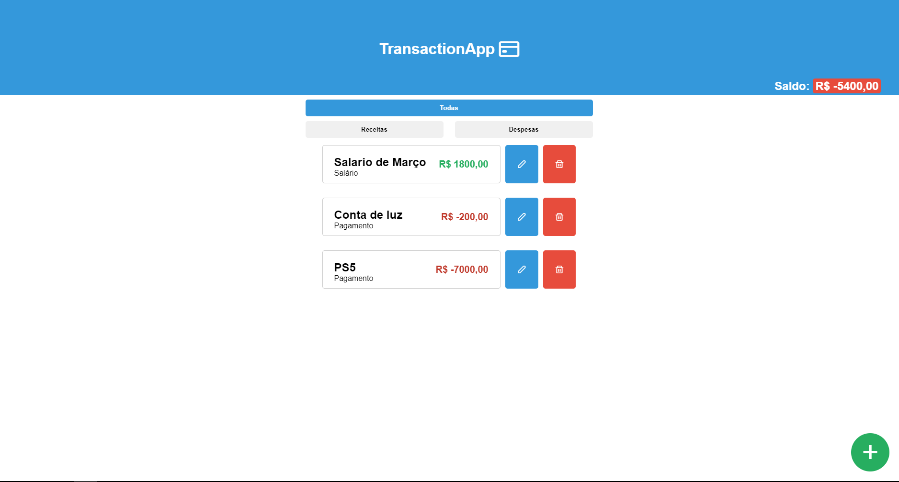
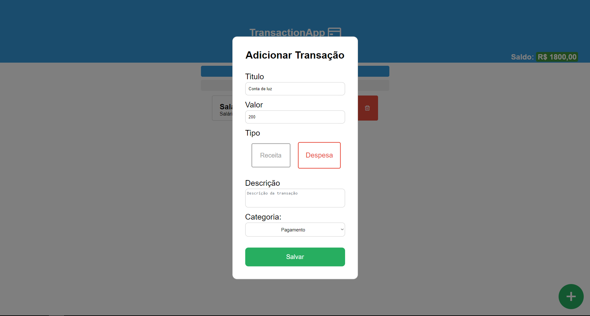
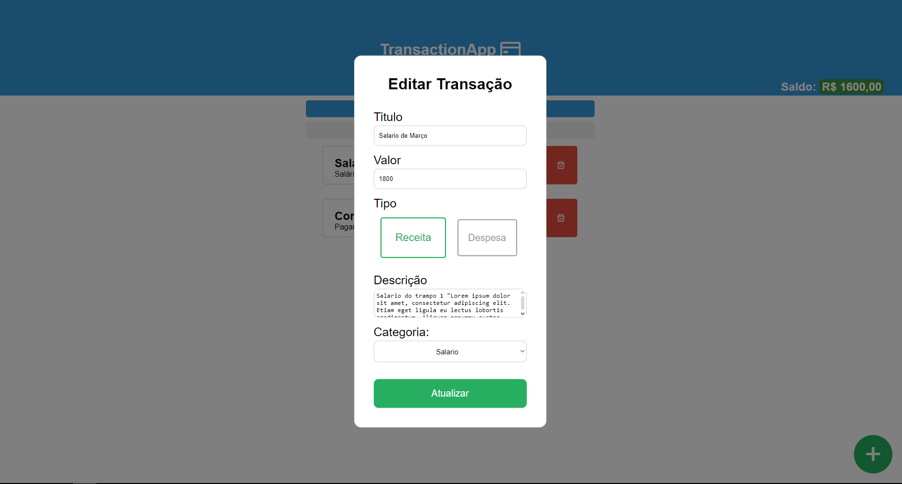
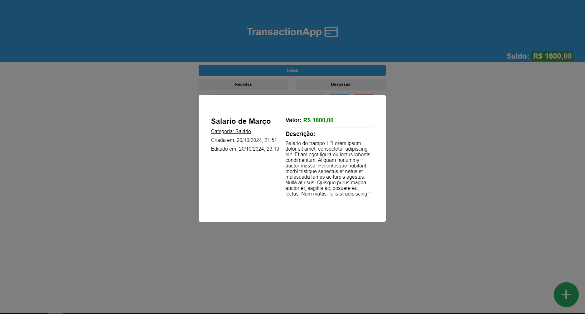
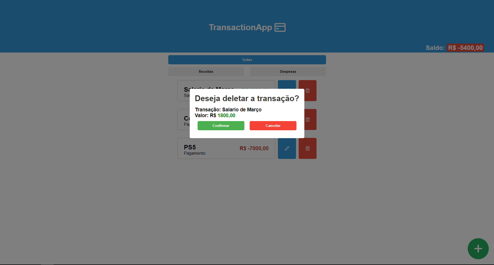

<h1 align="center"> TransactionApp 💵</h1>
<div align="center">
    
    
    
    
    
  
</div>


# Índices 🗂
* [Sobre](#sobre-)
* [Screenshots](#screenshots-)
* [Como usar](#como-usar-)
* [Links](#links-)

# Sobre ☄

Um pequeno projeto de um sistema de gerenciamente de transações financeiras. O projeto consegue gerenciar tanto as entradas as 
de receitas quanto as despesas.
Com ele, voce consegue:
- Visualizar as trasações cadastradas
- Cadastrar novas transações
- Editar as transações
- Excluir transações

# Screenshots 📸
<div display="inline" align="center">







</div>

# Como usar 💻

### 1. Configurando PHP para Rodar o Backend com Laravel

1. Certifique-se de ter o PHP instalado. Você pode baixar e instalar a versão mais recente do [site oficial do PHP](https://www.php.net/).
2. Instale o Composer, o gerenciador de dependências do PHP, seguindo as instruções no [site oficial do Composer](https://getcomposer.org/).
3. Navegue até o diretório do seu servidor PHP e copie a pasta backend neste local

4. Instale as dependências do Laravel:
    ```sh
    composer install
    ```

### 2. Criação do Banco de Dados

1. Certifique-se de ter um servidor de banco de dados MySQL ou MariaDB em execução.
2. Utilize o script localizado em `./banco/script.sql`

### 3. Instalando Dependências do Node.js para o Frontend em Angular

1. Certifique-se de ter o Node.js e o npm instalados. Você pode baixar e instalar a versão mais recente do [site oficial do Node.js](https://nodejs.org/).

2. Instale globalmente as dependências do Angular
    ```shell
    npm install -g @angular/cli
    ```


3. Navegue até o diretório do projeto e instale as dependências do projeto:
    ```sh
    npm install
    ```

### 4. Iniciando Todos os Serviços e Testando

1. No terminal do seu PHP server, inicie o servidor de desenvolvimento do Laravel:
    ```sh
    composer run dev
    ```
2. Em uma nova janela de terminal, inicie o servidor de desenvolvimento do Angular:
    ```sh
    npm start
    ```
3. Acesse a aplicação no navegador para verificar se tudo está funcionando corretamente:
    - Backend Laravel: `http://localhost:8000`
    - Frontend Angular: `http://localhost:4200`

4. Pronto! Seu projeto deve estar executando normalmente neste endereço do frontend. ( [imagens de exemplo](#screenshots-) )

# Links 🔗

Site oficial do PHP: [link](https://www.php.net/)

Site oficial do Composer: [link](https://getcomposer.org/)

Site oficial do Nodejs:[link](https://nodejs.org/)

<hr>
<div align="center">

Criado por [Iago Amorim](https://github.com/danonep2).

</div>

